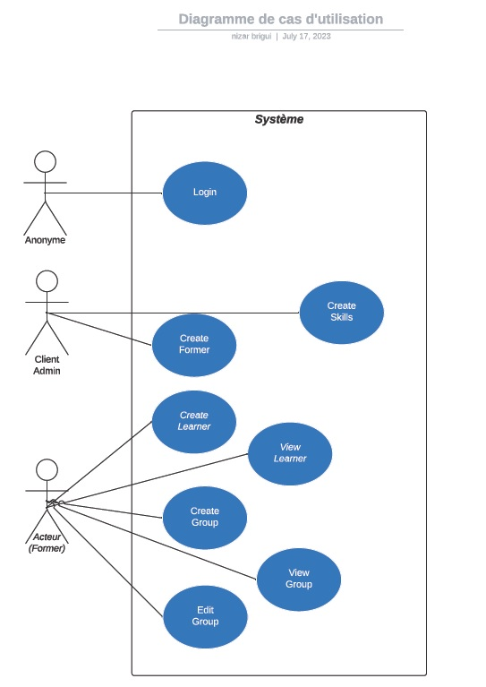
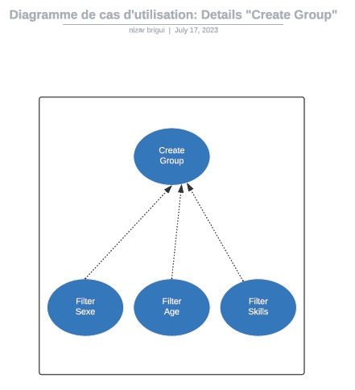
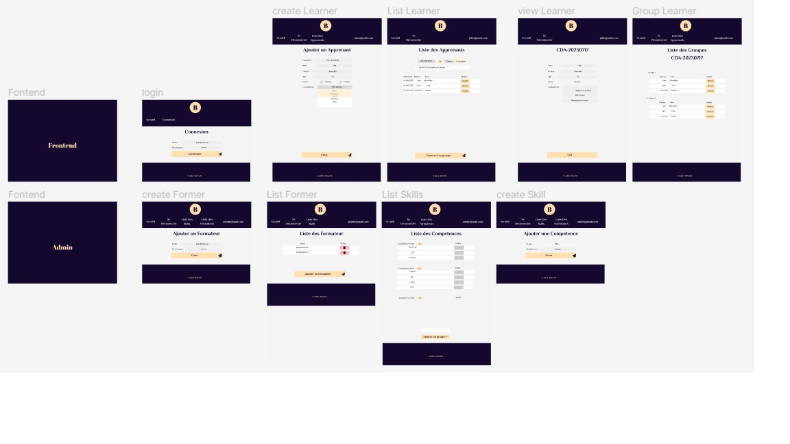

# Semaine de Testing CDA du 24/07/2023 au 28/07/2023

Dans le cadre de mon inscription au [CEFIM d'Orléans](https://www.cefim.eu/),  
pour une formation en alternance en vue d'obtenir un **titre RNCP - niveau 6 - Concepteur développeur d'applications**,  
il nous était demandé de réaliser, en autonomie, un mini projet suivant un cahier des charges fourni.

## Analyse du cahier des charges

Aprés analyse du cahier des charges,  
j'ai rédigé un résumé de ma compréhension de celui ci ainsi que des actions que je mettrai en place.

### 1. Explication de la demande du client :

Notre client, le centre de formation « BewVed », acteur dans le domaine des apprentissages relatifs au numérique,

nous demande de concevoir une application Web, utilisable par les formateurs, afin de gérer la répartition des apprenants d’une même promotion, au sein de diffèrents groupes de travail de taille définie par le formateur.

De plus cette application doit permettre au formateur de visualiser les détails de chaque apprenant.

Apres saisie par le formateur des différentes informations concernant tout son groupe d’apprenants
(promotion, Nom, Prénom, sexe, âge, et compétences).

L’application sera en mesure de générer une liste des différents groupes suivant le ou les filtres
appliqués (sexe, âge, compétences):

- Le filtre sexe favorisera une mixité des sexes.
- Le filtre âge favorisera une mixité des âges.
- Le filtre compétences permettra une répartition homogène suivant des compétences complémentaires.

### 2. Mise en place du projet :

Apres cette analyse des besoins de notre client, nous commencerons par établir un diagramme des cas d'utilisations
« use Case » correspondant à cette application.

Dans un second temps, nous procèderons au maquettage de l’application.

Apres réalisation d’un wireframe, nous créerons la maquette.

Puis, nous passerons à la modélisation de la base de données.  
Pour cela, nous commencerons par réaliser le diagramme de classes correspondant à l’ensemble du projet.

Une fois toutes ses étapes réalisées, nous commencerons le ‘codage‘ de l’application.

Mon choix c’est porté sur l’utilisation du Framework Symfony lié à une base de données SQL.

## Use Case

## Maquette

## Diagramme de classes

